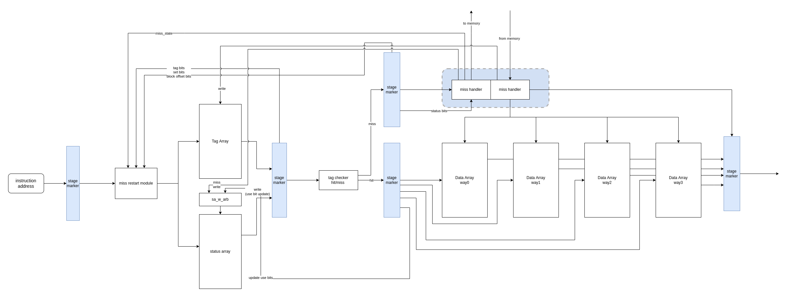
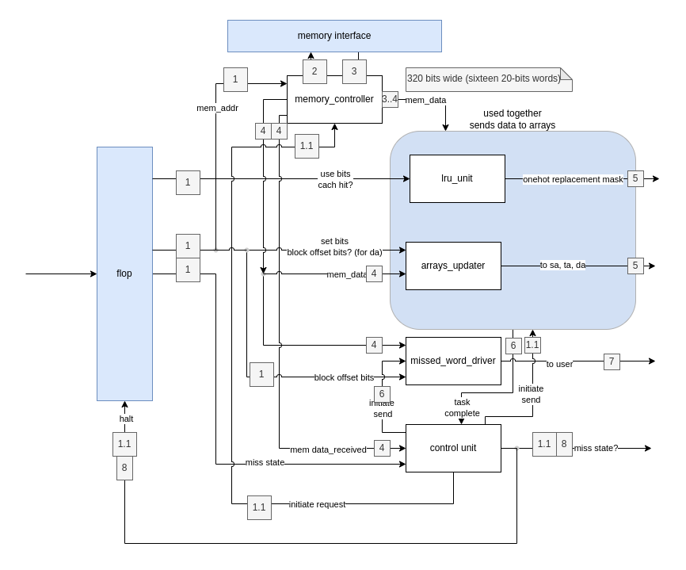
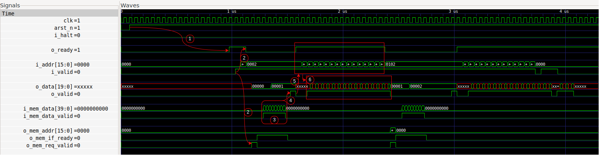

## Instruction Cache
Four-way set associative blocking cache with 16 sets and a block size of 16 words per block. Each word is 20-bits wide to store a predecoded 16-bit instruction. Best-case miss penalty of 5 cycles. Physical design performed using [OpenLane](https://github.com/The-OpenROAD-Project/OpenLane) and SKY130 PDK.

### Design Characteristics
- Best-case miss penalty of 5 cycles. This was achieved using the following techniques:
    - Transmitting data from memory to cache on both edges of the clock. This increases the bandwidth of cache-memory interface without increasing the width of the interface.
    - Overlapping data arrays updates with memory-cache transactionsm rather than waiting for memory-cache transactions to be complete.
- Cache parameters:
    - Number of sets: 16
    - Associativity: 4
    - Block size: 16 words per block
    - Word size: 20 bits (predecoded 16-bit instructions)
    - Cache capacity: 2.5 kilobytes 
- Pipelined blocking cache. The pipeline has three stages in a cache hit scenario.
- Implements pseudo-LRU replacement strategy.
    - The use-bit is ubpdated such that after every cache hit there is at least one block whose use-bit is zero. Only blocks with a use-bit of zero can be replaced when resolving a cache miss.
- Clock gating for write ports of data array SRAMs to improve power efficiency
    - Clock gating for write ports was not inplemented for status and tag array SRAMs in order to meet timing goals.

### Physical Design Details
Sythesis, Static timing analysis, and Physical Design were performed using [OpenLane](https://github.com/The-OpenROAD-Project/OpenLane) and SKY130 PDK. SRAM macros were made using [OpenRAM](https://openram.org/). The following are some metrics from the final physical layout: 

- Post-layout timing closed at 33.3 Mhz using OpenLane (OpenSTA).
- Core Area: 1.5629 mm2. 
- Core Dimensions: 1575.76 &#181;m x 991.89 &#181;m.

### Cache Data Organization
The SRAMs which served as data storage elements for the cache were built using sky130 SRAM created using [OpenRAM](https://openram.org/). There a a total of six SRAM macros which are used to store the data, tag and status for each way (or block) in the cache.
- **The Data Array** was implemented using four SRAMs. Each SRAM in the data array has 256 words with a word size of 20 bits.
- **The Tag Array** was implemented using one SRAM. This SRAM has 256 words with a word size of 32 bits since there are 4 ways each tagged with 8 bits
- **The status array** was implemented using one SRAM. This SRAM has 256 words with a word size of 8 bits since there are two status bits for each of the four ways. The stataus bits include a  valid bit and a use bit for pseudo-LRU replacement strategy. Valid bits are initalized to 0 upon reset.

### Architecture Diagrams
#### **High-level Overview**
As shown in the diagram below, the SRAMs composing the Data Array can be updated in parallel but only one can be read in a cache hit. Each Data Array SRAM does not represent to a way (or block), but rather each word in a block is shared between all four srams. This was done keep the SRAMs tall rather than wide since it was observed that wide SRAMS tends to occupy more area than tall SRAMs. If a single SRAM represeted a cache block, then the SRAM word would be 320 bits wide. In the  design shown below, each Data Array SRAM contains four 20-bit words for each way in each set. 

Please note that the diagram below is for illustrative purposes only and does not accurately reflect the connections between submodules. Stage markers are used to demarcate major "steps" in the cache's operation. 

High-level diagram showing main subcomponents of the Instruction Cache

 

#### **Communication Diagram for Cache Miss Handler**

Components and communication sequence of cache miss handler.  Sigal names in RTL are differ from the ones shown in the diagram

### Simulation Waveform 

The waveform below shows the behaviour of the instruction showing, initialization (1), cache miss (2), refill (3-4), and subsequent cache hits (5-6)

Simulation waveform showing initialization, cache miss, cache refill and subsequent cache hits 
Simulation performed using <a href="http://iverilog.icarus.com/">iverilog</a>. Annotations performed using <a href="https://www.diagrams.net/">diagrams.net</a>

 
The key stages shown in the simulation waveform above are:

1. Initialization of valid bits in the tag array after the instruction cache comes out of reset. Once all 64 valid bits are initialized, the `o_ready` signal is asserted, indicating that the cache is ready to receive read requests.
2. The very first read request is received. Since the cache is empty, this initial request triggers a compulsory miss. The `o_ready` signal is deasserted and `o_mem_req_valid` is asserted to request a block from memory. 
3. The block is sent from some higher-level memory structure. Data is transmitted on both rising and falling edge of the clock to minimize the miss penalty without needed to increase the width memory-cache data bus. As data is being received from memory, the data array is also being updated (after a set number of words have been received). This is also done to minimize the cache miss penalty.
4. Once refill is complete, the requested word is set to the user. 
5. The `o_ready` signal is asserted and new read requests are sampled.
6. Subsequent read requests to the same cache block result in cache hits.

### Physical Layout Images
#### **Full Layout (OpenROAD GUI)**
")

Full layout with all layers shown. 
Visualized using <a href="https://theopenroadproject.org/">OpenROAD</a> gui

#### **Full Layout (Klayout)**
")

Final GDS. 
Visualized using <a href="https://www.klayout.de/">Klayout</a>

#### **Clock Tree (OpenROAD GUI)**

")

Clock Tree distribution. Clock tree synthesis was performed using OpenROAD's TritonCTS 
Visualized using <a href="https://theopenroadproject.org/">OpenROAD</a> gui

### Learnings Worth Sharing
- To pre-elaborate RTL and automate file generation, use [perlpp](https://github.com/interpreters/perlpp) or [vpp.pl](https://github.com/interpreters/perlpp).
- Hold violations with very little negative slack may be resolved by decreasing placement density.
- Keep Amdahl's law in mind when evaluating design trade-offs.
